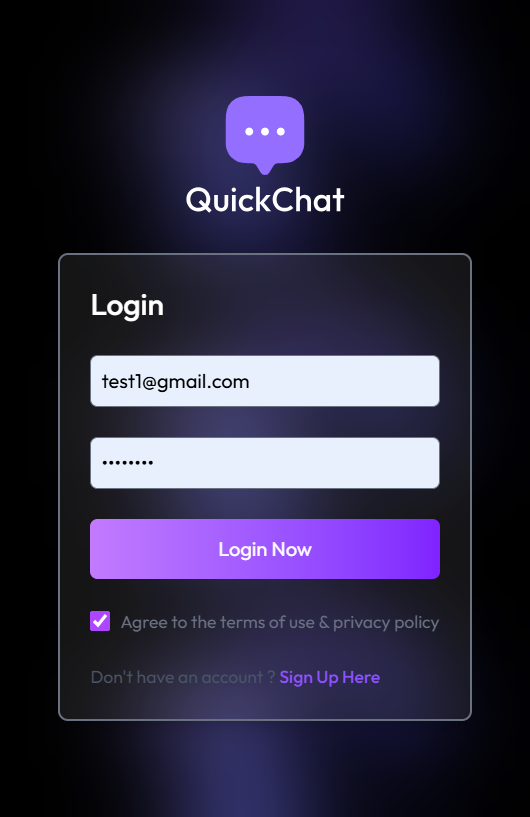
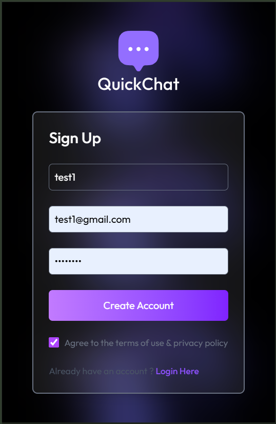
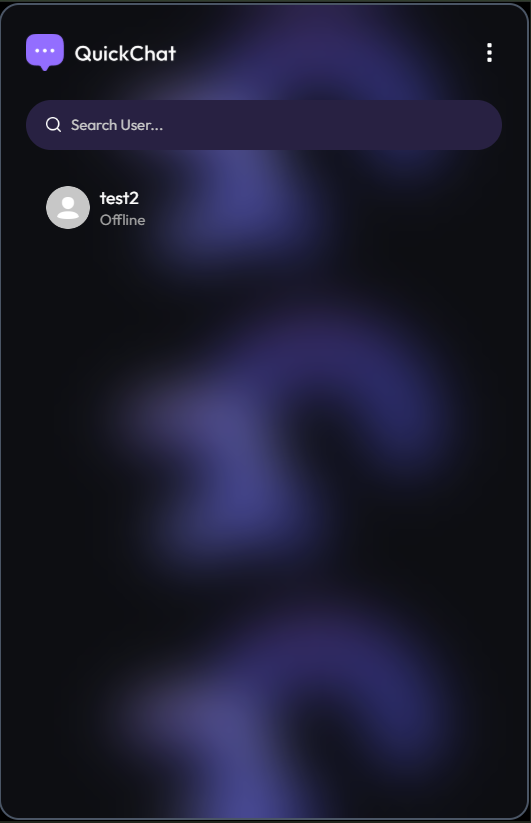
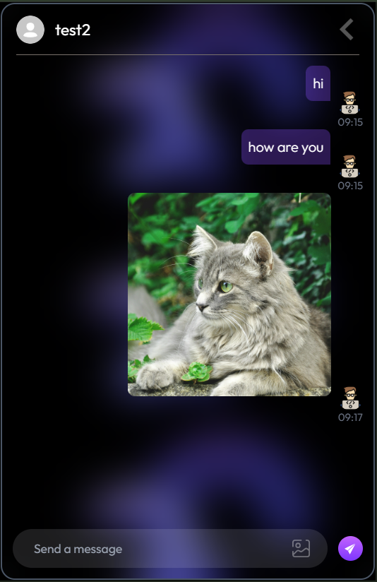
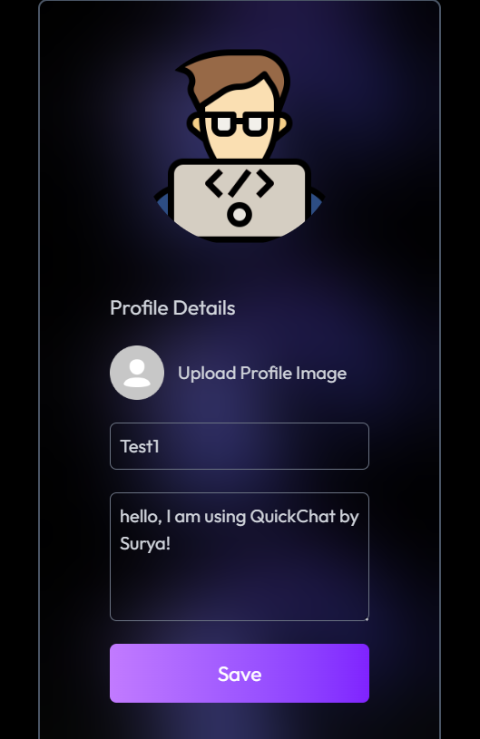

<div id="top"></div>

<div align="center">

# 💬 QUICKCHAT BY SURYA
*A Real-time Chat Application with Authentication & Cloud Media Support*


**Tech Stack Used**


</div>

---

## 📸 Screenshots

### 🖥️ Desktop View

| Login | Signup | Home |
|:--:|:--:|:--:|
|  |  |  |

| Chat (1-to-1) | Profile |
|:--:|:--:|
|  |  |

---

### 📱 Mobile View

| Login | Signup | Home |
|:--:|:--:|:--:|
|  |  |  |

| Chat (1-to-1) | Profile |
|:--:|:--:|
|  |  |

---

## 📑 Table of Contents

- [Overview](#-overview)
- [Demo](#-demo)
- [Features](#-features)
- [Tech Stack](#-tech-stack)
- [Project Structure](#-project-structure)
- [Getting Started](#-getting-started)
- [Environment Variables](#-environment-variables)
- [Usage](#-usage)
- [Future Enhancements](#-future-enhancements)
- [Contact](#-contact)

---

## 🧐 Overview

**QuickChat** is a real-time chat application with secure authentication, user profiles, and message media uploads. Users can sign up, log in, chat one-to-one, share text & images, and manage their profiles.  
Powered by **MERN + Socket.IO**, it ensures live messaging and a smooth UI using **TailwindCSS**.

---

## 🔗 Demo

> Live Preview: https://quickchatbysurya.vercel.app

---

## ✨ Features

✅ User signup & login (JWT-based authentication)  
✅ Real-time 1-to-1 chat with Socket.IO  
✅ Send and receive text messages  
✅ Upload & send images (Cloudinary)  
✅ Edit user profile, avatar & bio  
✅ Persistent login with JWT token  
✅ Fully responsive UI – Desktop & Mobile  

---

## ⚙️ Tech Stack

### **Frontend:**
- React (Vite)
- Tailwind CSS
- Axios
- Context API

### **Backend:**
- Node.js
- Express.js
- MongoDB + Mongoose
- JWT Authentication
- Socket.IO (Real-time messaging)
- Cloudinary (Media Uploads)

### **Deployment:**
- Vercel (Frontend)
- Vercel (Backend)

---

## 📂 Project Structure

```bash
Chat-App/
├── client/
|   ├── context/                     # Frontend (React + Vite)
│   ├── public/
│   └── src/
│       ├── assets/
│       ├── components/
│       ├── pages/
│       └── App.jsx
└── server/                     # Backend (Node.js + Express)
    ├── controllers/
    ├── lib/
    ├── middlewares/
    ├── models/
    ├── routes/
    └── server.js
```

---

## 🚀 Getting Started

### ✅ Prerequisites

- Node.js & npm installed
- MongoDB connection URL
- Cloudinary Account

---

### 👇 Installation

```bash
# Clone the repository
git clone https://github.com/Surya821/Chat-App

# Navigate to the project
cd Chat-App
```

### 🔧 Setup Client

``` bash
cd client
npm install
npm run dev
```

### 🖥️ Setup Server

``` bash
cd server
npm install
npm run server
```

---

## 🔐 Environment Variables

Create a .env file in the server folder:
```bash
MONGODB_URI=your_mongodb_url
PORT=5000
JWT_SECRET=your_jwt_secret
CLOUDINARY_CLOUD_NAME=xxxx
CLOUDINARY_API_KEY=xxxx
CLOUDINARY_API_SECRET=xxxx
```

---

## ▶️ Usage

1. **Create an account & log in**
2. **Start 1-to-1 private chat**
3. **Send messages & upload images**
4. **Edit your profile anytime**

---

## 🚧 Future Enhancements

- 🟦 Group Chat Feature  
- 🟦 Delete & Edit Messages  
- 🟦 Real-time Typing & Online Status  
- 🟦 Push Notifications  
- 🟦 Voice & Video Calls  

---

## 📬 Contact

**Created by — Surya Pratap Singh**  
📩 **Contact Me:**  
[LinkedIn](https://www.linkedin.com/in/surya-pratap-singh1/) • [Gmail](mailto:surya30082005@gmail.com)

If you like this project, consider giving it a ⭐ on GitHub!

<p align="right">(<a href="#top">⬆️ Back to Top</a>)</p>


